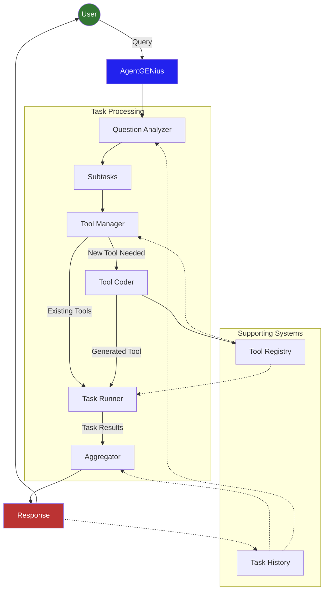

```
                          _    _____ ______ _   _ _           
    /\                   | |  / ____|  ____| \ | (_)          
   /  \   __ _  ___ _ __ | |_| |  __| |__  |  \| |_ _   _ ___ 
  / /\ \ / _` |/ _ \ '_ \| __| | |_ |  __| | . ` | | | | / __|
 / ____ \ (_| |  __/ | | | |_| |__| | |____| |\  | | |_| \__ \
/_/    \_\__, |\___|_| |_|\__|\_____|______|_| \_|_|\__,_|___/
          __/ |                                               
         |___/                                                
```


# AgentGENius

AgentGENius is a powerful AI agent framework, built on top of Pydantic AI, that enables intelligent task execution and automation through a combination of natural language processing and modular tool integration (also auto-generated).

## Features

- **Intelligent Task Management**: Breaks down complex tasks into manageable subtasks
- **Built-in Tools**: Comprehensive set of built-in tools for file operations, web searches, and system interactions
- **Task History**: Maintains a history of executed tasks and their results
- **Extensible Architecture**: Easy integration of new tools and capabilities
- **Streamlit Interface**: Example web interface for interacting with the agent

## Installation

1. Clone the repository:
```bash
git clone https://github.com/MicPec/AgentGENius.git
cd AgentGENius
```

2. Create and activate a virtual environment:
```bash
uv sync
```

3. Add API keys to the `.env` file:
```code
OPENAI_API_KEY="sk-proj-****"
TAVILY_API_KEY="tvly-****"
```
Those two keys can be obtained from the [OpenAI API](https://platform.openai.com) and [Tavily API](https://app.tavily.com/) websites.
## Usage

### CLI Chat Application

1. Start the CLI chat application:
```bash
uv run example.py
```

### Streamlit Interface

1. Start the Streamlit interface:
```bash
uv run streamlit run streamlit_app.py --server.headless=true
```

2. Open your browser and navigate to the displayed URL (typically http://localhost:8501)

3. Enter your queries in natural language and let AgentGENius handle the rest!

## Flow

The following diagram shows the high-level architecture and flow of AgentGENius:



The flow consists of several key components:

1. **Question Analyzer**: Breaks down user queries into manageable subtasks
2. **Tool Manager**: Identifies and manages tools needed for each task
3. **Tool Coder**: Generates new tools when required
4. **Task Runner**: Executes tasks using available tools
5. **Aggregator**: Combines task results into coherent responses

Supporting components include:
- **Task History**: Maintains conversation context
- **Tool Registry**: Manages available tools and their definitions
- **Callback System**: Provides real-time status updates (not on the diagram for readability) 

## Project Structure

```
AgentGENius/
├── agentgenius/          # Core package
│   ├── main.py           # Main agent implementation
│   ├── builtin_tools.py  # Built-in tool definitions
│   ├── config.py         # Configuration settings
│   └── ...
├── history/              # Task history storage
├── streamlit_app.py      # Example Streamlit web interface
├── example.py            # Example CLI chat application
└── pyproject.toml        # Project dependencies
```
Tools generated by AgentGENius are stored in the `{TEMP}/agentgenius/tools` directory.

## License

This project is licensed under the MIT License - see the LICENSE file for details.
